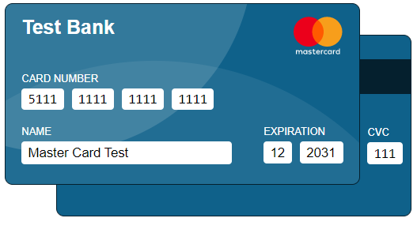

# nodejs-credit-card
NodeJS Credit Card Simulator

# Example Image

# License
Please see [Apache 2.0](./LICENSE) license for details

# References
Cook, K. (2022, October 25). <i>How To Create This Advanced Credit Card Form With CSS/JavaScript</i>. YouTube. Retrieved October 25, 2022, from https://www.youtube.com/watch?v=dpccMFOYtHM